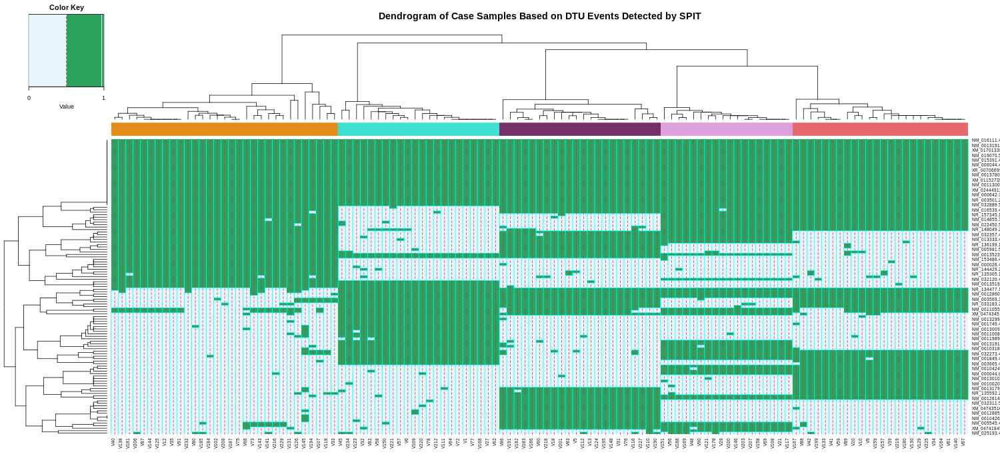

.. SPIT documentation master file, created on Thu Jul 06 22:17:29 2023.
   You can adapt this file completely to your liking, but it should at least
   contain the root `toctree` directive.

SPIT
=================================
    
.. image:: https://img.shields.io/badge/License-GPLv3-blue.svg
    :target: https://www.gnu.org/licenses/gpl-3.0
    :alt: GPLv3 License
    
.. image:: https://img.shields.io/github/v/tag/berilerdogdu/spit?style=flat-square
	:target: https://img.shields.io/github/v/tag/berilerdogdu/spit?style=flat-square
	:alt: GitHub tag (latest SemVer)
    
**SPIT** is a statistical tool that quantifies the heterogeneity in transcript usage within a population 
and identifies predominant subgroups along with their distinctive sets of DTU events.

-------------------

.. role:: img-inline
.. |colab_logo| image:: content/images/colab.png
   :class: img-inline
   :alt: SPIT Colab
   :target: https://colab.research.google.com/github/berilerdogdu/spit/blob/master/notebooks/SPIT.ipynb
.. raw:: html

   

Try **SPIT** out with no installation and setup using Google Colab |colab_logo|.
You can get familiar with the software using the provided test data, or analyse your own datasets with ease
using the cloud resources for free!

   :align: center

User Guide
--------------

.. toctree::
   :maxdepth: 2

   user/install
   user/quickstart
   user/file_formats
   user/examples
   user/contact